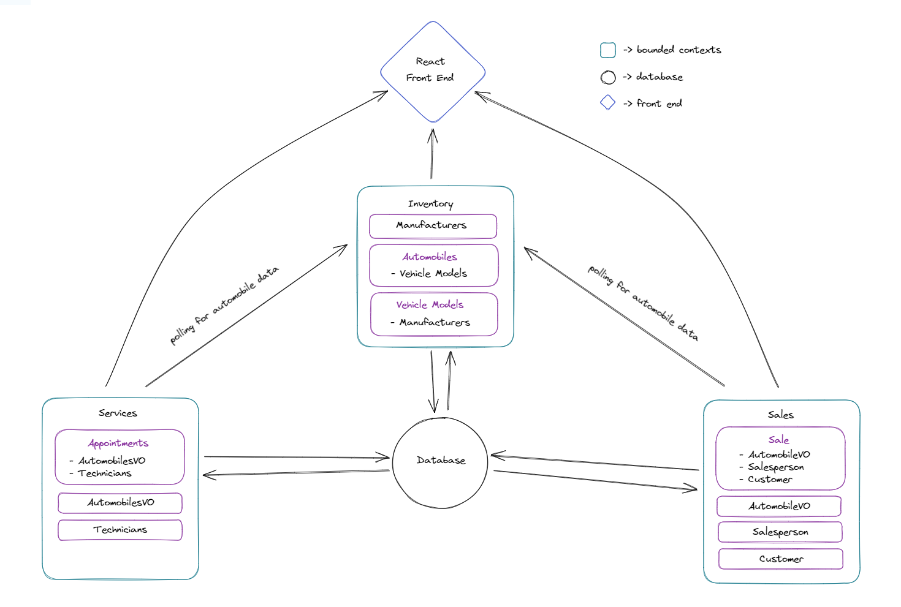

# CarCar

Contributors:

* Brandon Dinh (Service microservice)
* Aaron Tran (Sales microservice)
* Adrianna Helfrich (Sales microservice)

## Installation

**Cloning down the Repository:**
1. Open your command line and navigate to a directory where you would like this project to be cloned to
2. To clone via HTTPS run: `git clone https://gitlab.com/dinhbrandon/project-beta.git`
3. Change directory into the newly cloned project directory `cd project-beta`

**Setting up Docker:** \
In your command line run the following snippets of code:
1. Create the Docker Volume required for Project Beta:
`docker volume create beta-data`
2. Build docker images:
`docker-compose build`
3. Starts and runs docker containers:
`docker-compose up`

Now you should have a running application on **http://localhost:3000**! \
Refer to the documentation below for a breakdown of the urls and features associated with the application.

Depending on which version of the application you would like to run, switch to either of these branches:
- `git checkout main` (Brandon & Adrianna)
- `git checkout main2` (Brandon & Aaron)

## Design

### Diagram of Architecture


### URLs & Ports for Microservices

#### Inventory API
- **LIST manufacturers** http://localhost:3000/manufacturers/
    -  Displays list of all manufacturers present inside the database
- **CREATE manufacturer** http://localhost:3000/manufacturers/create/
    - Allows user to create a new instance of a manufacturer
    - Needed properties: Manufacturer name
- **LIST vehicle models** http://localhost:3000/models/
    - Displays list of all vehicle models present inside the database
- **CREATE vehicle model** http://localhost:3000/models/create/
    - Allows user to create a new instance of a vehicle model
    - Needed properties: Model name, Picture url, Manufacturer
- **LIST automobiles** http://localhost:3000/automobiles/
    - Displays list of all automobiles present inside the database
- **CREATE automobile** http://localhost:3000/automobiles/create
    - Allows user to create a new instance of an automobile
    - Needed properties: Color, Year, VIN, Model name

#### Service API
- **LIST technicians** http://localhost:3000/technicians
    -  Displays list of all technicians from the database
- **CREATE technician** http://localhost:3000/technicians/create
    - Allows user to add technicians to the database
    - Needed properties: First name, Last name, Employee ID
- **LIST appointments** http://localhost:8080/api/appointments/
    - Displays list of all service appointments from the database
- **CREATE an appointment** http://localhost:3000/appointments/create
    - Allows user to add a new service appointment
    - Needed properties: Automobile VIN, Customer, Date, Time, Technician, Reason
- **LIST service appointments** http://localhost:3000/appointments
    - Displays list of all service appointments in the database
- **LIST service appointment history** http://localhost:3000/appointments/history
    - Displays list of all finished or canceled service appointments

#### Sales API
- **LIST Salespeople** http://localhost:3000/salespeople
    -  Displays a list of all salespeople present inside the database
- **CREATE Salesperson** http://localhost:3000/salespeople/create
    -  Allows user to create a new instance of a salesperson
    -  Needed properties: first name, last name, employee id
- **LIST Customers** http://localhost:3000/customers
    -  Displays a list of all customers present inside the database
- **CREATE Customer** http://localhost:3000/customers/create
    -  Allows user to create a new instance of a customer inside the database
    -  Needed properties: first name, last name, address, phone number
- **LIST Sales** http://localhost:3000/sales
    -  Displays a list of all the sales present inside the database
- **CREATE Sale** http://localhost:3000/sales/create
    -  Allows user to create a new instance of a sale inside the database
    -  Needed properties: automobile VIN, salesperson, customer, price
- **LIST Sales History** http://localhost:3000/sales/history
    -  Displays a list of all the sales present inside the database that is able to be filtered by salesperson through the dropdown at the top of the page

### Docker Containers

**Inventory-API** \
URL: http://localhost:8100/ \
Ports: 8100:8000

**Sales-API** \
URL: http://localhost:8090/ \
Ports: 8090:8000

**Sales-Poller**

**Service-API** \
URL: http://localhost:8080/ \
Ports: 8080:8000

**Service-Poller**

**React** \
URL: http://localhost:3000/ \
Ports: 3000:3000

**Database** \
URL: http://localhost:15432:5432/ \
Ports: 15432:5432


### CRUD Routes

#### Inventory-API

<details>
<summary>Manufacturer</summary>

\
**POST** \
URL: http://localhost:8100/manufacturers/:id/ \
Description: Creates a manufacturer \
Sample POST Data:
```
{
    “name”: “manufacturer_name”
}

```
Expected Response Data Example:
```
{
    “href”: “/api/manufacturers/1/”,
    “id”: 1,
    “name”: “manufacturer_name”
}
```
**GET** \
URL: http://localhost:8100/manufacturers/ \
Description: Grabs the list of manufacturers \
Expected Response Data:
```
{
    “manufacturers”: [
        {
            “href”: “/api/manufacturers/1/”,
            “id”: 1,
            “name”: “manufacturer_name”
        }
    ]
}

```
**GET** \
URL: http://localhost:8100/manufacturers/:id/ \
Description: Grabs a specific manufacturer \
Expected Response Data:
```
{
    “href”: “/api/manufacturers/1/”,
    “id”: 1,
    “name”: “manufacturer_name”
}

```
**PUT** \
URL: http://localhost:8100/manufacturers/:id/ \
Description: Updates a specific manufacturer \
Sample PUT Data:
```
{
    “name”: “manufacturer_name”
}
```
Expected Response Data:
```
{
    “href”: “/api/manufacturers/1/”,
    “id”: 1,
    “name”: “manufacturer_name”
}

```
**DELETE** \
URL: http://localhost:8100/manufacturers \
Description: Deletes a specific manufacturer \
Expected Response Data:
```
{
    “id”: null,
    “name”: “manufacturer_name”
}
```

</details>

<details>
<summary>Vehicle Models</summary>

\
**POST** \
URL: http://localhost:8100/api/models/ \
Description: Creates a vehicle model \
Sample POST Data:
```
{
  "name": "Sebring",
  "picture_url": "https://upload.wikimedia.org/wikipedia/commons/thumb/7/71/Chrysler_Sebring_front_20090302.jpg",
  "manufacturer_id": 1
}

```
Expected Response Data:
```
{
	"href": "/api/models/1/",
	"id": 1,
	"name": "Sebring",
	"picture_url": "https://upload.wikimedia.org/wikipedia/commons/thumb/7/71/Chrysler_Sebring_front_20090302.jpg",
	"manufacturer": {
		"href": "/api/manufacturers/1/",
		"id": 1,
		"name": "Honda"
	}
}
```

**GET** \
URL: http://localhost:8100/api/models/ \
Description: List all vehicle models \
Expected Response Data Example:
```
{
	"models": [
		{
			"href": "/api/models/1/",
			"id": 1,
			"name": "Sebring",
			"picture_url": "https://upload.wikimedia.org/wikipedia/commons/thumb/7/71/Chrysler_Sebring_front_20090302.jpg/320px-Chrysler_Sebring_front_20090302.jpg",
			"manufacturer": {
				"href": "/api/manufacturers/1/",
				"id": 1,
				"name": "Chrysler"
			}
		},
		{
			"href": "/api/models/3/",
			"id": 3,
			"name": "Sebring",
			"picture_url": "https://upload.wikimedia.org/wikipedia/commons/thumb/7/71/Chrysler_Sebring_front_20090302.jpg/320px-Chrysler_Sebring_front_20090302.jpg",
			"manufacturer": {
				"href": "/api/manufacturers/1/",
				"id": 1,
				"name": "Chrysler"
			}
		},
		{
			"href": "/api/models/4/",
			"id": 4,
			"name": "Tundra",
			"picture_url": "https://cdn.shopify.com/s/files/1/0175/8496/products/color_blackwhite_1_reid_sneakers_800x800.jpg?v=1618340529",
			"manufacturer": {
				"href": "/api/manufacturers/2/",
				"id": 2,
				"name": "Toyota"
			}
		}
	]
}

```

**GET** \
URL: http://localhost:8100/api/models/:id/ \
Description: List specific vehicle models \
Expected Response Data Example:
```
{
	"href": "/api/models/1/",
	"id": 1,
	"name": "Sebring",
	"picture_url": "https://upload.wikimedia.org/wikipedia/commons/thumb/7/71/Chrysler_Sebring_front_20090302.jpg/320px-Chrysler_Sebring_front_20090302.jpg",
	"manufacturer": {
		"href": "/api/manufacturers/1/",
		"id": 1,
		"name": "Chrysler"
	}
}

```

**PUT** \
URL: http://localhost:8100/api/models/:id/ \
Description: Update specific vehicle models \
Expected Response Data Example:
```
{
	"href": "/api/models/1/",
	"id": 1,
	"name": "Tundra",
	"picture_url": "https://upload.wikimedia.org/wikipedia/commons/thumb/7/71/Chrysler_Sebring_front_20090302.jpg/320px-Chrysler_Sebring_front_20090302.jpg",
	"manufacturer": {
		"href": "/api/manufacturers/1/",
		"id": 1,
		"name": "Chrysler"
	}
}

```

**DELETE** \
URL: http://localhost:8100/api/models/:id/ \
Description: Delete specific vehicle model \
Expected Response Data Example:
```
{
	"id": null,
	"name": "Tundra",
	"picture_url": "https://upload.wikimedia.org/wikipedia/commons/thumb/7/71/Chrysler_Sebring_front_20090302.jpg/320px-Chrysler_Sebring_front_20090302.jpg",
	"manufacturer": {
		"href": "/api/manufacturers/1/",
		"id": 1,
		"name": "Honda"
	}
}
```

</details>

<details>
<summary>Automobiles</summary>

\
**GET** \
URL: http://localhost:8100/api/automobiles/ \
Description: Gets list of all automobiles\
Expected Response Data:
```
{
	"autos": [
		{
			"href": "/api/automobiles/1C3CC5FB2AN120174/",
			"id": 1,
			"color": "red",
			"year": 2012,
			"vin": "1C3CC5FB2AN120174",
			"model": {
				"href": "/api/models/1/",
				"id": 1,
				"name": "Sebring",
				"picture_url": "https://upload.wikimedia.org/wikipedia/commons/thumb/7/71/Chrysler_Sebring_front_20090302.jpg/320px-Chrysler_Sebring_front_20090302.jpg",
				"manufacturer": {
					"href": "/api/manufacturers/1/",
					"id": 1,
					"name": "Chrysler"
				}
			},
			"sold": false
		},
			]
}
```
\
**POST** \
URL: http://localhost:8100/api/automobiles/ \
Description: Creates new automobile \
Sample POST Data:
```
{
  "color": "red",
  "year": 2012,
  "vin": "1C3CC5FB2AN120174",
  "model_id": 1
}
```
Expected Response Data:
```
{
	"href": "/api/automobiles/1C3CC5FB2AN120174/",
	"id": 1,
	"color": "red",
	"year": 2012,
	"vin": "1C3CC5FB2AN120174",
	"model": {
		"href": "/api/models/1/",
		"id": 1,
		"name": "Sebring",
		"picture_url": "https://upload.wikimedia.org/wikipedia/commons/thumb/7/71/Chrysler_Sebring_front_20090302.jpg/320px-Chrysler_Sebring_front_20090302.jpg",
		"manufacturer": {
			"href": "/api/manufacturers/1/",
			"id": 1,
			"name": "Chrysler"
		}
	},
	"sold": false
}
```
\
**PUT** \
URL:  http://localhost:8100/api/automobiles/:vin/\
Description: Edit a specific automobile\
Sample PUT Data:
```
{
	"color": "pink"
}
```
Expected Response Data:
```
{
	"href": "/api/automobiles/1C3CC5FB2AN120174/",
	"id": 1,
	"color": "pink",
	"year": 2012,
	"vin": "1C3CC5FB2AN120174",
	"model": {
		"href": "/api/models/1/",
		"id": 1,
		"name": "Sebring",
		"picture_url": "https://upload.wikimedia.org/wikipedia/commons/thumb/7/71/Chrysler_Sebring_front_20090302.jpg/320px-Chrysler_Sebring_front_20090302.jpg",
		"manufacturer": {
			"href": "/api/manufacturers/1/",
			"id": 1,
			"name": "Chrysler"
		}
	},
	"sold": false
}
```
\
**DELETE** \
URL: http://localhost:8100/api/automobiles/:vin/ \
Description: Delete a specific automobile \
Expected Response Data:
```
{
	"href": "/api/automobiles/1C3CC5FB2AN120174/",
	"id": 1,
	"color": "pink",
	"year": 2012,
	"vin": "1C3CC5FB2AN120174",
	"model": {
		"href": "/api/models/1/",
		"id": 1,
		"name": "Sebring",
		"picture_url": "https://upload.wikimedia.org/wikipedia/commons/thumb/7/71/Chrysler_Sebring_front_20090302.jpg/320px-Chrysler_Sebring_front_20090302.jpg",
		"manufacturer": {
			"href": "/api/manufacturers/1/",
			"id": 1,
			"name": "Chrysler"
		}
	},
	"sold": false
}

```

</details>

#### Service API

<details>
<summary>Technician</summary>

\
**POST** \
URL: http://localhost:8080/api/technicians/ \
Description: Creates an instance of technician

Sample POST Data
```
{
	"first_name": "Abraham",
	"last_name": "Washington",
	"employee_id": 32723
}

```
Expected Response Data:
```
{
	"first_name": "Abraham",
	"last_name": "Washington",
	"employee_id": 32723,
	"id": 13
}
```

**GET** \
URL: http://localhost:8080/api/technicians/ \
Description: List all technicians \
Expected Response Data Example:
```
{
	"technicians": [
		{
			"first_name": "Aaron",
			"last_name": "Tran",
			"employee_id": "32765",
			"id": 1
		},
		{
			"first_name": "Adrianna",
			"last_name": "Helfrich",
			"employee_id": "32766",
			"id": 2
		},
		{
			"first_name": "Brandon",
			"last_name": "Dinh",
			"employee_id": "32767",
			"id": 3
		},
		{
			"first_name": "George",
			"last_name": "Washington",
			"employee_id": "32755",
			"id": 4
		}
	]
}

```

</details>

<details>
<summary>Appointment</summary>

\
**GET** \
URL: http://localhost:8080/api/appointments/ \
Description: List all service appointments \
Expected Response Data Example:
```
{
	"appointments": [
		{
			"id": 17,
			"date_time": "2023-04-25T23:52:42+00:00",
			"reason": "Headlights aint working",
			"status": "Canceled",
			"is_vip": true,
			"vin": "ABC123",
			"customer": "Linda Wang",
			"technician": {
				"first_name": "Aaron",
				"last_name": "Tran",
				"employee_id": "32765",
				"id": 1
			}
		},
		{
			"id": 18,
			"date_time": "2023-04-25T23:52:42+00:00",
			"reason": "Headlights aint working",
			"status": "Finished",
			"is_vip": false,
			"vin": "1552GASGA2",
			"customer": "Bubba Hump",
			"technician": {
				"first_name": "Brandon",
				"last_name": "Dinh",
				"employee_id": "32767",
				"id": 3
			}
		},
		{
			"id": 19,
			"date_time": "2023-04-27T23:52:42+00:00",
			"reason": "It squeaks",
			"status": "Finished",
			"is_vip": false,
			"vin": "1622GASGA2",
			"customer": "Momo Fuku",
			"technician": {
				"first_name": "Brandon",
				"last_name": "Dinh",
				"employee_id": "32767",
				"id": 3
			}
		}
	]
}

```

**POST** \
URL: http://localhost:8080/api/appointments/ \
Description: Creates a new service appointment \
Expected Response Data Example:
```
{
	"id": 39,
	"date_time": "2023-04-27T23:52:42+00:00",
	"reason": "My car is making a weird sound.",
	"status": "In progress",
	"is_vip": false,
	"vin": "BCD123",
	"customer": "Kelly Blantt",
	"technician": {
		"first_name": "Aaron",
		"last_name": "Tran",
		"employee_id": "32765",
		"id": 1
	}
}
```

**PUT** \
URL: http://localhost:8080/api/appointments/:id/finish \
Description: Change status of appointment to 'finished' \
Expected Response Data Example:
```
{
	"id": 4,
	"date_time": "2023-04-25T23:52:42+00:00",
	"reason": "Car makes weird sound when starting.",
	"status": "Finished",
	"is_vip": false,
	"vin": "1C3CC5FB2AN120154",
	"customer": "Bill Horsting",
	"technician": {
		"first_name": "Aaron",
		"last_name": "Tran",
		"employee_id": 32765,
		"id": 1
	}
}
```

**PUT** \
URL: http://localhost:8080/api/appointments/:id/cancel \
Description: Change status of appointment to 'canceled' \
Expected Response Data Example:
```
{
	"id": 6,
	"date_time": "2023-04-25T23:52:42+00:00",
	"reason": "Car is dirty",
	"status": "Canceled",
	"is_vip": false,
	"vin": "ABC123",
	"customer": "Brian Anderson",
	"technician": {
		"first_name": "Aaron",
		"last_name": "Tran",
		"employee_id": 32765,
		"id": 1
	}
}

```

</details>

#### Sales-API (Main - Adrianna)

<details>
<summary>Salesperson</summary>

\
**GET** \
URL: http://localhost:8090/api/salespeople/ \
Description: Get list of all salespeople \
Expected Response Data:
```
{
	"salespeople": [
		{
			"first_name": "Brandon",
			"last_name": "Dinh",
			"employee_id": 12345,
			"id": 1
		}
	]
}
```

**POST** \
URL: http://localhost:8090/api/salespeople/ \
Description: Create a new salesperson \
Sample POST Data:
```
{
  "first_name": "Adrianna",
  "last_name": "Helfrich",
  "employee_id": "17283"
}
```
Expected Response Data:
```
{
	"first_name": "Adrianna",
	"last_name": "Helfrich",
	"employee_id": "17283",
	"id": 4
}
```

**DELETE** \
URL: http://localhost:8090/api/salespeople/:id \
Description: Delete an individual salesperson \
Expected Response Data:
```
{
	"deleted": true
}
```

</details>

<details>
<summary>Customer</summary

\
**GET** \
URL: http://localhost:8090/api/customers/ \
Description: Get list of all customers \
Expected Response Data:
```
{
	"customers": [
		{
			"first_name": "Adrianna",
			"last_name": "Helfrich",
			"address": "111 Insomnia Drive, San Jose CA",
			"phone_number": "4749394095",
			"id": 2
		},
		{
			"first_name": "Brandon",
			"last_name": "Dinh",
			"address": "222 Django Court, San Francisco CA",
			"phone_number": "8689360571",
			"id": 3
		},
		{
			"first_name": "Aaron",
			"last_name": "Tran",
			"address": "333 Python Place, San Francisco CA",
			"phone_number": "6289460173",
			"id": 4
		}
	]
}
```

**POST** \
URL: http://localhost:8090/api/customers/ \
Description: Create a new customer \
Sample POST Data:
```
{
  "first_name": "Aaron",
  "last_name": "Tran",
  "address": "333 Python Place, San Francisco CA",
	"phone_number": "6289460173"
}
```
Expected Response Data:
```
{
	"first_name": "Aaron",
	"last_name": "Tran",
	"address": "333 Python Place, San Francisco CA",
	"phone_number": "6289460173",
	"id": 4
}
```

**DELETE** \
URL: http://localhost:8090/api/customers/1 \
Description: Delete a specific customer \
Expected Response Data:
```
{
	"deleted": true
}
```

</details>

<details>
<summary>Sale</summary>

**GET** \
URL: http://localhost:8090/api/sales/ \
Description: Get list of all sales \
Expected Response Data:
```
{
	"sales": [
		{
			"automobile": {
				"vin": "12323542134535436",
				"import_href": "/api/automobiles/12323542134535436/",
				"sold": false
			},
			"salesperson": {
				"first_name": "Aaron",
				"last_name": "Tran",
				"employee_id": 67890,
				"id": 2
			},
			"customer": {
				"first_name": "Aaron",
				"last_name": "Tran",
				"address": "333 Python Place, San Francisco CA",
				"phone_number": "6289460173",
				"id": 4
			},
			"price": 20000,
			"id": 2
		}
	]
}
```

**POST** \
URL: http://localhost:8090/api/sales/ \
Description: Create new sale \
Sample POST Data:
```
{
  "automobile": "1C3CC5FB2AN120174",
  "salesperson": 1,
  "customer": 3,
	"price": 32000
}
```
Expected Response Data:
```
{
	"automobile": {
		"vin": "1C3CC5FB2AN120174",
		"import_href": "/api/automobiles/1C3CC5FB2AN120174/",
		"sold": true
	},
	"salesperson": {
		"first_name": "Brandon",
		"last_name": "Dinh",
		"employee_id": 12345,
		"id": 1
	},
	"customer": {
		"first_name": "Brandon",
		"last_name": "Dinh",
		"address": "222 Django Court, San Francisco CA",
		"phone_number": "8689360571",
		"id": 3
	},
	"price": 32000,
	"id": 9
}
```

**DELETE** \
URL: http://localhost:8090/api/sales/:id \
Description: Delete a specific sale \

Expected Response Data:
```
{
	"deleted": true
}
```

</details>

<details>
<summary>AutomobileVO</summary>

**GET** \
URL: http://localhost:8090/api/autovo/ \
Description: Get a list of all automobile value objects \
Expected Response Data:
```
{
	"autos": [
		{
			"vin": "1C3CC5FB2AN120174",
			"import_href": "/api/automobiles/1C3CC5FB2AN120174/",
			"sold": false
		}
	]
}
```

</details>


#### Sales-API (Main2 - Aaron)

<details>
<summary>Salesperson</summary>

\
**POST** \
URL: http://localhost:8090/api/salespeople/ \
Description: Create a salesperson \
Sample POST Data:
```
{
	"first_name": "Person",
	"last_name": "One",
	"employee_id": "1"
}
```
Expected Response Data:
```
{
	"href": "/api/salespeople/1/",
	"id": 1,
	"first_name": "Person",
	"last_name": "One",
	"employee_id": "1"
}
```
**GET** \
URL: http://localhost:8090/api/salespeople/ \
Description: Grabs the list of salespeople \
Expected Response Data:
```
{
	"salespeople": [
		{
			"href": "/api/salespeople/1/",
			"id": 1,
			"first_name": "Person",
			"last_name": "One",
			"employee_id": "1"
		},
		{
			"href": "/api/salespeople/2/",
			"id": 2,
			"first_name": "Person",
			"last_name": "Two",
			"employee_id": "2"
		},
	]
}
```
**DELETE** \
URL: http://localhost:8090/api/salespeople/:id \
Description: Deletes a specific salesperson \
Expected Response Data:
```
{
	"id": null,
	"first_name": "Person",
	"last_name": "One",
	"employee_id": "1"
}
```

</details>

<details>
<summary>Customer</summary>

\
**POST** \
URL: http://localhost:8090/api/customers/ \
Description: Creates a customer \
Sample POST Data:
```
{
	"first_name": "Customer",
	"last_name": "One",
	"address": "Customer One Address",
	"phone_number": "111-111-1111"
}
```
Expected Response Data:
```
{
	"href": "/api/customers/1",
	"id": 1,
	"first_name": "Customer",
	"last_name": "One",
	"address": "Customer One Address",
	"phone_number": "111-111-1111"
}
```
**GET** \
URL: http://localhost:8090/api/customers/ \
Description: Grabs the list of customers \
Expected Response Data:
```
{
	"customers": [
        {
            "href": "/api/customers/1",
            "id": 1,
            "first_name": "Customer",
            "last_name": "One",
            "address": "Customer One Address",
            "phone_number": "111-111-1111"
        },
		{
			"href": "/api/customers/2",
			"id": 2,
			"first_name": "Customer",
			"last_name": "Two",
			"address": "Customer Two Address",
			"phone_number": "222-222-2222"
		},
	]
}
```
**DELETE** \
URL: http://localhost:8090/api/customers/:id \
Description: Deletes a specific customer \
Expected Response Data:
```
{
	"id": null,
    "first_name": "Customer",
    "last_name": "One",
    "address": "Customer One Address",
    "phone_number": "111-111-1111"
}
```

</details>

<details>
<summary>Sale</summary>

\
**POST** \
URL: http://localhost:8090/api/sales/ \
Description: Creates a sale \
Sample POST Data:
```
{
	"automobile": "/api/automobiles/VinNumber1/",
	"salesperson_id": 1,
	"customer_id": 1,
	"price": 50000
}
```
Expected Response Data:
```
{
	"href": "/api/sales/1/",
	"id": 1,
	"automobile": {
		"import_href": "/api/automobiles/VinNumber1/",
		"vin": "VinNumber1",
		"sold": true
	},
	"salesperson": {
		"href": "/api/salespeople/1/",
		"id": 1,
		"first_name": "Person",
		"last_name": "One",
		"employee_id": "1"
	},
	"customer": {
		"href": "/api/customers/1",
		"id": 1,
		"first_name": "Customer",
		"last_name": "One",
		"address": "Customer One Address",
		"phone_number": "111-111-1111"
	},
	"price": 50000
}
```
**GET** \
URL: http://localhost:8090/api/sales/ \
Description: Grabs the list of sales \
Expected Response Data:
```
{
	"sales": [
        {
            "href": "/api/sales/1/",
            "id": 1,
            "automobile": {
                "import_href": "/api/automobiles/VinNumber1/",
                "vin": "VinNumber1",
                "sold": true
            },
            "salesperson": {
                "href": "/api/salespeople/1/",
                "id": 1,
                "first_name": "Person",
                "last_name": "One",
                "employee_id": "1"
            },
            "customer": {
                "href": "/api/customers/1",
                "id": 1,
                "first_name": "Customer",
                "last_name": "One",
                "address": "Customer One Address",
                "phone_number": "111-111-1111"
            },
            "price": 50000
        },
		{
			"href": "/api/sales/2/",
			"id": 2,
			"automobile": {
				"import_href": "/api/automobiles/VinNumber2/",
				"vin": "VinNumber2",
				"sold": true
			},
			"salesperson": {
				"href": "/api/salespeople/1/",
				"id": 1,
				"first_name": "Person",
				"last_name": "One",
				"employee_id": "1"
			},
			"customer": {
				"href": "/api/customers/2",
				"id": 2,
				"first_name": "Customer",
				"last_name": "Two",
				"address": "Customer Two Address",
				"phone_number": "222-222-2222"
			},
			"price": 25000
		},
	]
}
```
**DELETE**
URL: http://localhost:8090/api/sales/:id \
Description: Deletes a specific sale \
Expected Response Data:
```
{
	"id": null,
	"automobile": {
        "import_href": "/api/automobiles/VinNumber2/",
        "vin": "VinNumber2",
        "sold": true
    },
    "salesperson": {
        "href": "/api/salespeople/1/",
        "id": 1,
        "first_name": "Person",
        "last_name": "One",
        "employee_id": "1"
    },
    "customer": {
        "href": "/api/customers/2",
        "id": 2,
        "first_name": "Customer",
        "last_name": "Two",
        "address": "Customer Two Address",
        "phone_number": "222-222-2222"
    },
    "price": 25000
}
```

</details>

<details>
<summary>AutomobileVO</summary>

#### AutomobileVO (Sales-API Main2-Aaron)
**GET** \
URL: http://localhost:8090/api/autoVO/ \
Description: Grabs the list of Automobile Value Objects \
Expected Response Data:
```
{
	"autos": [
		{
			"import_href": "/api/automobiles/VinNumber1/",
			"vin": "VinNumber1",
			"sold": false
		},
        {
			"import_href": "/api/automobiles/VinNumber2/",
			"vin": "VinNumber2",
			"sold": false
		},
    ]
}
```

</details>

### Value Objects

#### Service-Api (**AutomobileVO**)
-  In the Service-API we also poll for automobile data from our inventory microservice to have access to the VIN numbers of cars that the dealership has sold. With this data, we cross-reference the customer's VIN of their vehicle to determine if they receive VIP status on their appointments for purchasing the car from our dealership.


#### Sales-Api (**AutomobileVO**)

Why **AutomobileVO**?
- You need **vin** and **sold** information from the Automobile Model present in the Inventory microservice to create a record of a car sale in the sales microservice

Properties of **AutomobileVO**:
-  By polling automobile information from the Inventory microservice we can create value object models with **import_href**, **vin**, and **sold** properties
- **Import_href** is derived based off of the **href** property of the Automobile model and serves as the backend value that is used to reference the AutomobileVO object in CRUD requests
- **Vin** information is directly polled from the Inventory microservice and is used for user-friendly display of data in front-end forms
- **Sold** property allows admin to accurately make sell records with cars that have not been sold


## Service microservice

### Models

#### Technician
- Properties of technicians include **first_name**, **last_name**, and **employee_id**
- Instances of technicians can be manipulated based on the type of HTTP request that's made. Currently we are only handling listing technicians and adding new technicians.
- The logic for handling technician models are all within the views for this microservice.

#### Appointment
- Includes **vin**, **customer**, **date_time**, **is_vip**, **technician** and **status** properties
- Handles all appointment related manipulation
- Contains a foreignKey to the technician model, meaning that appointments must have an instance of technician to reference to
- Status property is altered in the views based on whether a user triggers the is_finished or is_canceled function by clicking on the finish or cancel button on the form
-The is_vip property logic is also handled in the back-end and is triggered by a conditional statement which checks to see if the VIN number that a customer entered matches a VIN number of an automobile that is within the inventory API
-Appointments can also be listed in two different ways: service appointment (active) or service appointment (history). When a user marks a service appointment as finished or canceled, it is removed from the active list to the history list. The service history list also contains a search function which allows the user to narrow the list down by VIN number.

#### AutomobileVO
- This model only includes a **vin** property.

#### Integration with Inventory Microservice
- The automovileVO model draws from the automobile model from the inventory API via a poller; however, the only property that we adopt into our service API is the **vin** property, which we use to reference if a customer would receive VIP status on their appointment.

## Sales microservice (Main - Adrianna)

### Models

#### Salesperson
- Fields: `first_name`, `last_name`, `sold`

#### Customer
- Fields: `first_name`, `last_name`, `address`, `phone_number`

#### Sale
- Fields: `automobile`, `salesperson`, `customer`, `price`

#### AutomobileVO
- Fields: `vin`, `import_href`, `sold`

### Explanation
- Each model contains the necessary fields, and within the Sale model, there are three foreign keys. The Salesperson and Customer foreign keys link within the same document to their respective models such that they can be used within Sale as well. For the automobile field, I created an AutomobileVO in my models.py so that I could use the data from the Automobile model in the inventory as a value object within my models. I also have a poller implemented to retrieve data from the Inventory microservice in order to access and utilize information for the automobiles.

## Sales microservice (Main2-Aaron)

### Models

#### Salesperson
- Includes **first_name**, **last_name**, and **employee_id** properties
- Serves to deal with data involving Salespeople (create a salesperson, get a list of salespeople, delete a salesperson)
-Used to display a list of salespeople for users to interact with
- Referenced through the use of a Foreign Key when creating a record of a car sale

#### Customer
- Includes **first_name**, **last_name**, **address**, and **phone_number** properties
- Serves to deal with data involving Customers (create a customer, get a list of customers, delete a customer)
- Used to display a list of customers for users to interact with
- Referenced through the use of a Foreign Key when creating a record of a car sale

#### Sale
- Includes **automobile**, **salesperson**, **customer**, and **price** properties. The automobile, salesperson, and customer properties are all foreign keys associated with the other models present in the sales microservice
- Serves to deal with data involving Sales (create a sale, get a list of sales, delete a sale)
- Used to display a list of sales as well as create a salesperson history webpage for users to interact with

#### AutomobileVO
- Includes **import_href**, **vin**, and **sold** properties
- Serves to deal with data required from the Automobile Model present in the Inventory-API
- Referenced through the use of a Foreign Key when creating a record of a car sale

#### Integration with Inventory Microservice
- To create a record of a car sale, the microservice requires Automobile data (href, vin, and sold properties) present in the Inventory Microservice
- Created a poller that requests data from the Automobile Model and utilizes that information to create a AutomobileVO model
- With the data present in AutomobileVO (import_href and vin), we can create a record of a car sale and adjust the sold property of the model accordingly
